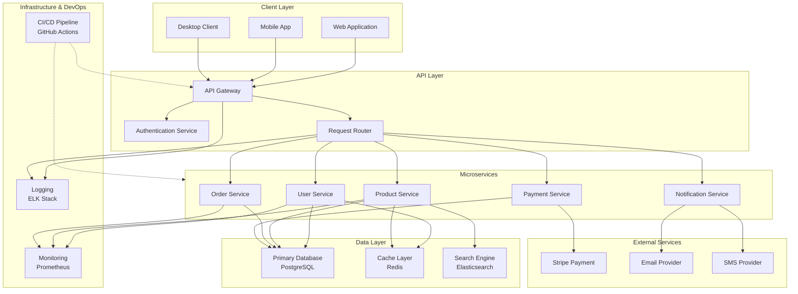

# System Architecture Overview

## High-Level Architecture

## Overview

This architecture follows a layered design with client applications communicating through an API gateway to backend services. The services manage core business functionality, persist data in a primary database, and leverage caching and search systems for performance and discovery.

## Components

- Client Layer: web, mobile, and desktop entry points
- API Layer: gateway, authentication, and request routing
- Microservices: user, product, order, payment, and notification services
- Data Layer: PostgreSQL, Redis, and Elasticsearch
- External Services: payment and messaging providers
- Infrastructure: monitoring, logging, and CI/CD automation

## Flow

1. Clients send requests to the API gateway.
2. Authentication and routing validate and direct requests.
3. Services process business logic and interact with shared data stores.
4. External providers handle payment and notification workflows.
5. Monitoring and logging collect operational insights across the stack.
