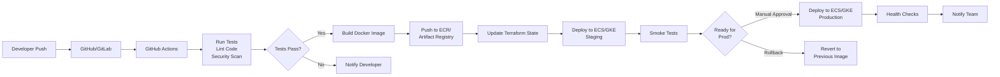

# System Architecture Overview

## High-Level Architecture

```mermaid
graph TB
    subgraph CDN["Content Delivery"]
        CF["CloudFront / Cloud CDN"]
    end

    subgraph FE["Frontend Layer"]
        WEB["React/Vue.js SPA"]
        MOBILE["React Native App"]
    end

    subgraph LB["Load Balancing & Security"]
        ALB["Application Load Balancer"]
        WAF["Web Application Firewall"]
        ROUTE53["Route 53 / Cloud DNS"]
    end

    subgraph API["API Layer - ECS/GKE"]
        APIGW["API Gateway"]
        AUTH["Auth Service"]
        RATELIMIT["Rate Limiter"]
    end

    subgraph Microservices["Microservices - ECS/GKE Containers"]
        USERS["User Service<br/>Port: 3001"]
        PRODUCTS["Product Service<br/>Port: 3002"]
        ORDERS["Order Service<br/>Port: 3003"]
        PAYMENT["Payment Service<br/>Port: 3004"]
        INVENTORY["Inventory Service<br/>Port: 3005"]
        NOTIFICATION["Notification Service<br/>Port: 3006"]
    end

    subgraph DBCluster["Database Layer - RDS/Cloud SQL"]
        MASTER["PostgreSQL Master<br/>Primary DB"]
        REPLICA1["PostgreSQL Replica 1<br/>Read-Only"]
        REPLICA2["PostgreSQL Replica 2<br/>Read-Only"]
    end

    subgraph Cache["Cache & Session Layer"]
        REDIS["Redis Cluster<br/>ElastiCache / Memorystore"]
    end

    subgraph Search["Search & Analytics"]
        ES["Elasticsearch Domain<br/>Managed Service"]
        KIBANA["Kibana Dashboard"]
    end

    subgraph Queue["Message Queue"]
        SQS["AWS SQS / Google Pub/Sub"]
        KAFKA["Apache Kafka Cluster"]
    end

    subgraph Storage["Storage Layer"]
        S3["S3 / Cloud Storage<br/>User Uploads"]
        DDB["DynamoDB / Firestore<br/>NoSQL"]
    end

    subgraph External["External Services"]
        STRIPE["Stripe API"]
        SENDGRID["SendGrid Email"]
        TWILLIO["Twilio SMS"]
    end

    subgraph Monitoring["Observability Stack"]
        PROM["Prometheus<br/>Metrics"]
        GRAFANA["Grafana<br/>Dashboards"]
        CLOUDWATCH["CloudWatch / Cloud Logging"]
        XRAY["X-Ray / Cloud Trace"]
        DATADOG["Datadog APM"]
    end

    subgraph CI["CI/CD Pipeline"]
        GH["GitHub / GitLab"]
        ACTIONS["GitHub Actions"]
        ECR["ECR / Artifact Registry"]
        TERRAFORM["Terraform IaC"]
    end

    subgraph Registry["Container Registry & Secrets"]
        ECR2["Amazon ECR / GCP Artifact Registry"]
        SECRETS["AWS Secrets Manager<br/>Google Secret Manager"]
    end

    subgraph Orchestration["Container Orchestration"]
        ECS["AWS ECS Fargate<br/>or Google GKE"]
        AUTOSCALE["Auto Scaling Group"]
    end

    CF --> ROUTE53
    WEB --> CF
    MOBILE --> ALB
    ROUTE53 --> ALB
    ALB --> WAF
    WAF --> APIGW
    APIGW --> AUTH
    APIGW --> RATELIMIT

    RATELIMIT --> USERS
    RATELIMIT --> PRODUCTS
    RATELIMIT --> ORDERS
    RATELIMIT --> PAYMENT
    RATELIMIT --> INVENTORY
    RATELIMIT --> NOTIFICATION

    USERS --> MASTER
    PRODUCTS --> MASTER
    ORDERS --> MASTER
    PAYMENT --> MASTER
    INVENTORY --> MASTER

    MASTER --> REPLICA1
    MASTER --> REPLICA2

    USERS --> REPLICA1
    PRODUCTS --> REPLICA2
    INVENTORY --> REPLICA1

    USERS --> REDIS
    PRODUCTS --> REDIS
    ORDERS --> REDIS
    AUTH --> REDIS

    PRODUCTS --> ES
    ORDERS --> ES
    ES --> KIBANA

    NOTIFICATION --> SQS
    ORDERS --> SQS
    PAYMENT --> SQS

    SQS --> KAFKA

    NOTIFICATION --> SENDGRID
    NOTIFICATION --> TWILLIO
    PAYMENT --> STRIPE

    USERS --> S3
    PRODUCTS --> S3
    ORDERS --> DDB

    USERS --> PROM
    PRODUCTS --> PROM
    ORDERS --> PROM
    ECS --> PROM

    PROM --> GRAFANA
    CLOUDWATCH --> GRAFANA
    XRAY --> DATADOG
    ECS --> CLOUDWATCH

    GH --> ACTIONS
    ACTIONS --> ECR2
    ECR2 --> ECS
    ECR2 --> AUTOSCALE
    TERRAFORM --> ECS

    AUTH --> SECRETS
    PAYMENT --> SECRETS
    NOTIFICATION --> SECRETS

    AUTOSCALE -.-> USERS
    AUTOSCALE -.-> PRODUCTS
    AUTOSCALE -.-> ORDERS
```



## Architecture Components

### 1. **Frontend Layer**
- **React/Vue.js SPA**: Single Page Application for desktop browsers
- **React Native App**: Native mobile application for iOS/Android
- **Client-Side Rendering**: Progressive Web App (PWA) capabilities
- **State Management**: Redux/Vuex for application state

### 2. **Content Delivery & Networking**
- **CloudFront / Cloud CDN**: Global content distribution, caching, compression
- **Route 53 / Cloud DNS**: DNS resolution, traffic routing, health checks
- **ALB (Application Load Balancer)**: Distributes incoming traffic across services
- **WAF (Web Application Firewall)**: Protection against DDoS, SQL injection, XSS attacks

### 3. **API Layer**
- **API Gateway**: Entry point for all requests, rate limiting, request/response transformation
- **Authentication Service**: JWT token generation, OAuth 2.0 integration, 2FA
- **Rate Limiter**: Per-user, per-IP throttling to prevent abuse

### 4. **Microservices (ECS Fargate / GKE)**
Each service runs in containerized environments with auto-scaling:

| Service | Purpose | Port | Dependencies |
|---------|---------|------|--------------|
| User Service | Profile, authentication, preferences | 3001 | PostgreSQL, Redis, Secrets Manager |
| Product Service | Catalog, pricing, categories | 3002 | PostgreSQL, Elasticsearch, S3 |
| Order Service | Order processing, fulfillment tracking | 3003 | PostgreSQL, DynamoDB, SQS |
| Payment Service | Payment processing, billing | 3004 | PostgreSQL, Stripe API, Secrets Manager |
| Inventory Service | Stock management, warehouse sync | 3005 | PostgreSQL, Redis, Kafka |
| Notification Service | Email, SMS, push notifications | 3006 | SendGrid, Twilio, SQS, Kafka |

### 5. **Database Layer - RDS / Cloud SQL**

```
Master-Replica Replication Strategy:
┌─────────────────────────────────────────┐
│  PostgreSQL Master (Primary Write)      │
│  - User data                            │
│  - Product catalog                      │
│  - Orders & transactions                │
│  - Payments & billing                   │
└──────────────────────────────────────────┘
         ↓                    ↓
┌──────────────────┐  ┌──────────────────┐
│ Replica 1        │  │ Replica 2        │
│ (Read-Only)      │  │ (Read-Only)      │
│ Zone A           │  │ Zone B           │
└──────────────────┘  └──────────────────┘
```

- **Multi-AZ Deployment**: High availability across availability zones
- **Automated Backups**: Daily snapshots retained for 30 days
- **Point-in-Time Recovery**: RPO < 5 minutes
- **Connection Pooling**: PgBouncer for efficient connection management
- **Parameter Groups**: Optimized for microservices (max_connections, shared_buffers)

### 6. **Caching Layer - Redis / ElastiCache**

- **Session Storage**: User sessions, authentication tokens
- **Rate Limiting State**: Track request counts per user/IP
- **Application Cache**: Database query results, computed data
- **Real-time Data**: Leaderboards, counters, product availability
- **Cache Invalidation Strategy**: TTL-based, event-driven, manual purging
- **Cluster Mode**: For high throughput and fault tolerance

### 7. **Search & Analytics - Elasticsearch**

- **Full-Text Search**: Product search, order history search
- **Aggregations**: Category facets, price ranges, filters
- **Log Aggregation**: Application and system logs
- **Real-Time Analytics**: User behavior, trending products
- **Index Management**: Daily indices with automatic rollover
- **Kibana Dashboards**: Visualizations and alerting

### 8. **Message Queue & Streaming**

**AWS SQS / Google Pub/Sub:**
- Order confirmation processing
- Payment status updates
- Notification dispatch
- FIFO queues for sequential processing

**Apache Kafka:**
- Real-time event streaming
- Inventory updates
- Order status changes
- Analytics pipeline input
- Log aggregation source

### 9. **Storage Layer**

**S3 / Cloud Storage:**
- User profile images
- Product images and thumbnails
- Invoice documents
- Backup archives
- Static assets (CSS, JS)

**DynamoDB / Firestore:**
- Order metadata and status
- Session data backup
- Real-time activity logs
- Time-series data

### 10. **External Services Integration**

- **Stripe API**: Payment processing with webhook handling
- **SendGrid**: Transactional and marketing emails
- **Twilio**: SMS notifications and OTP delivery
- **All secrets stored in**: AWS Secrets Manager / Google Secret Manager

### 11. **Observability & Monitoring**

**Metrics:**
- Prometheus: Scrapes metrics from all services (3000 metrics/sec)
- Grafana: Custom dashboards, alerting rules

**Logging:**
- CloudWatch / Cloud Logging: Centralized log collection
- Structured JSON logging from all services
- Log retention: 30 days hot, 1 year cold storage

**Tracing:**
- AWS X-Ray / Google Cloud Trace: Distributed tracing
- End-to-end request tracking across services
- Latency analysis and bottleneck identification

**APM:**
- Datadog: Application Performance Monitoring
- Custom instrumentation for business metrics
- Error tracking and alerting

### 12. **Container Orchestration**

**AWS ECS Fargate / Google GKE:**
- Serverless container management (Fargate) or Kubernetes (GKE)
- Auto Scaling Groups with target tracking (CPU: 70%, Memory: 80%)
- Service discovery via ECS Service Discovery / Kubernetes DNS
- Rolling deployments with health checks

### 13. **CI/CD Pipeline**



**Stages:**
1. **Commit Stage**: Unit tests, code style checks
2. **Build Stage**: Docker image creation, vulnerability scanning
3. **Push Stage**: ECR/Artifact Registry upload
4. **Deploy to Staging**: Automated deployment, integration tests
5. **Manual Approval**: QA verification, stakeholder sign-off
6. **Deploy to Production**: Blue-green or canary deployment
7. **Monitoring**: Health checks, rollback if needed

**Infrastructure as Code:**
- Terraform for AWS resources (VPC, RDS, ECS, ALB, etc.)
- Terraform for GCP resources (VPC, Cloud SQL, GKE, Load Balancing)
- Version control for all infrastructure changes
- Automated plan and apply in CI/CD pipeline

### 14. **Deployment Strategies**

**Blue-Green Deployment:**
```
Current (Blue)  ←→  New (Green)
   Active           Idle
                      ↓
              Run smoke tests
                      ↓
              Switch traffic
                      ↓
         Keep old for rollback
```

**Canary Deployment:**
```
Version N-1: 95% of traffic
Version N:   5% of traffic
            ↓ (monitor metrics)
         All pass?
            ↓
Gradually shift traffic (5% → 25% → 50% → 100%)
```

## Data Flow

### User Authentication Flow
1. User logs in via web/mobile app
2. Frontend sends credentials to API Gateway
3. Auth Service validates and generates JWT token
4. Token stored in Redis for session management
5. Subsequent requests include token for authorization

### Order Processing Flow
1. User submits order through web app
2. API Gateway validates request
3. Order Service creates order in PostgreSQL (Master)
4. Payment Service processes payment via Stripe
5. Order confirmation message published to SQS/Kafka
6. Notification Service picks up message and sends email/SMS
7. Inventory Service updates stock levels
8. Order status cached in Redis for quick retrieval
9. Search data indexed in Elasticsearch for analytics

### Product Search Flow
1. User searches for products
2. API Gateway routes to Product Service
3. Product Service queries Elasticsearch
4. Results cached in Redis (TTL: 5 minutes)
5. Subsequent searches hit cache
6. Cache invalidated when products updated

## Scalability & High Availability

### Horizontal Scaling
- **Microservices**: ECS Auto Scaling Groups (min: 2, max: 20 per service)
- **Database**: Read replicas handle 80% of queries
- **Cache**: Redis Cluster mode with multiple shards
- **Search**: Elasticsearch shards distributed across zones

### Vertical Scaling
- **Container Resources**: Dynamic allocation based on metrics
- **Database**: RDS storage auto-scaling enabled
- **Cache**: Automatic eviction policies (LRU)

### Fault Tolerance
- Multi-AZ deployments for all stateful services
- Database replication with automatic failover (RTO: < 2 min)
- Service mesh for circuit breakers and retry logic
- Dead letter queues for failed message processing
- Graceful degradation: non-critical services can fail without affecting core functionality

## Security Architecture

### Network Security
- VPC with public/private subnets
- NAT Gateway for private service egress
- Security groups for service-to-service communication
- NACLs for additional network segmentation

### Application Security
- API Gateway authentication/authorization
- JWT token validation on every request
- Rate limiting and DDoS protection via WAF
- Secrets Manager for API keys and credentials
- TLS 1.3 for all data in transit
- AES-256 encryption for data at rest

### Compliance & Auditing
- CloudTrail / Cloud Audit Logs for all API calls
- Encrypted backups with immutable retention
- GDPR-compliant data retention policies
- Regular security scanning and penetration testing

## Cost Optimization

- **Reserved Instances**: 30% discount for ECS/database workloads
- **Spot Instances**: Cost-effective for non-critical batch jobs
- **S3 Lifecycle Policies**: Move old backups to Glacier
- **CloudFront Caching**: Reduce origin requests by 60%
- **Right-sizing**: Monitor and adjust container/database resources quarterly

## Disaster Recovery

| Component | RPO | RTO | Strategy |
|-----------|-----|-----|----------|
| Database | 5 min | 2 min | Multi-AZ, automated failover |
| Services | 1 min | 5 min | Multi-AZ deployment, health checks |
| Cache | 0 | 1 min | Rebuild from database on recovery |
| Storage | 1 day | 30 min | S3 cross-region replication |

## Monitoring & Alerts

**Critical Alerts:**
- Database CPU > 80% for 5 minutes
- Service error rate > 1% for 2 minutes
- API latency p99 > 500ms for 5 minutes
- Cache hit ratio < 70% for 15 minutes
- Message queue depth > 10,000 messages

**Dashboard Metrics:**
- Request throughput (req/sec)
- Error rate by service (%)
- API latency (p50, p95, p99)
- Database connections and queries
- Cache hit/miss ratio
- Disk space and memory utilization

---

## Technology Stack Summary

| Category | Technology | Purpose |
|----------|-----------|---------|
| Frontend | React/Vue.js, TypeScript | Web application |
| Frontend | React Native | Mobile app |
| Backend | Node.js / Python | Microservices runtime |
| API | Express.js / FastAPI | API framework |
| Database | PostgreSQL | Primary relational database |
| Cache | Redis | Session & application cache |
| Search | Elasticsearch | Full-text search & analytics |
| Queue | AWS SQS / Kafka | Async processing |
| Storage | S3 / Cloud Storage | Object storage |
| NoSQL | DynamoDB / Firestore | Document database |
| Container | Docker | Containerization |
| Orchestration | ECS Fargate / GKE | Container orchestration |
| IaC | Terraform | Infrastructure as code |
| CI/CD | GitHub Actions | Automation pipeline |
| Monitoring | Prometheus, Grafana | Metrics & visualization |
| Logging | CloudWatch / Cloud Logging | Centralized logging |
| Tracing | X-Ray / Cloud Trace | Distributed tracing |
| APM | Datadog | Application performance |

---

*Last Updated: 2026-10-06*
*Architecture Version: 2.0*
